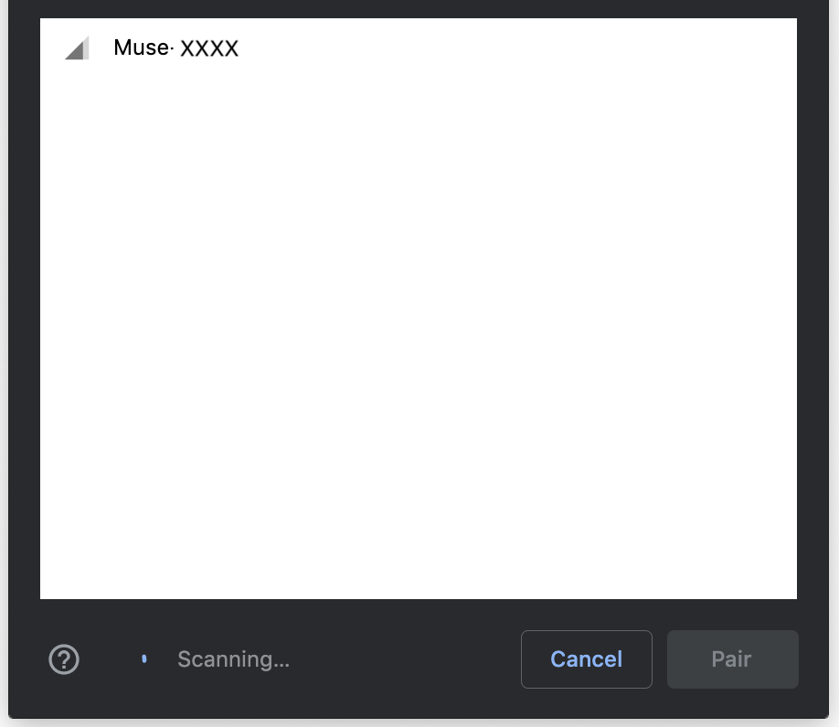

# BCIDevice

BCIDevice attempts to consolidate Brain-Computer Interface (BCI) development in the
browser by adding a layer of abstraction over existing WebBluetooth drivers for
the [Muse](https://choosemuse.com/) (using [muse-js](https://github.com/urish/muse-js)) and the
[OpenBCI Ganglion](https://shop.openbci.com/products/pre-order-ganglion-board?variant=13461804483) (using
[ganglion-ble](https://github.com/neurosity/ganglion-ble)).

## Building

In order to build the webpack file, simply run `npm run build` or `yarn build`. The generated webpack file
will then be found in the `dest` folder.

## Using

### Initialize

In order to use this library, first create a `BCIDevice` (with optional data handlers) as shown below:

```javascript
let bci = new BCIDevice({
    dataHandler: data => {...},           // Handles real-time data streamed from the headset in the form
                                          // { data: Array<number>, electrode: number, sampleRate: number }

    statusHandler: status => {...},       // Handles real-time telemetry data in the form
                                          // { TODO }

    connectionHandler: connected => {...} // Handles real-time connection info in the form
                                          // connected: boolean
})
```

### Connect / Disconnect

In order to connect, due to the security policies of WebBluetooth, attach the function
`bci.connect()` to some form of user input and a popup should show up with valid BCI devices to select from, as shown below:



Disconnections can be triggered by running `bci.disconnect()`.

As a note: `connect()` supports `await` and throws errors either when the user cancels the connection prompt or if the
connection fails. Wrapping `connect()` in a `try | catch` block in an asynchronous function, as shown below:

```javascript
let connect_function = async () => {
	try {
		await bci.connect();
		// Here, the device is for sure connected
	} catch (e) {
		// Here, the user cancelled or the device failed to connect.
	}
}
```

# Caveats

The Ganglion board does not provide connection subscriptions and telemetry data such as battery power and temperature,
so the `statusHandler` and the `connectionHandler` are not truly supported.

# License

Copyright 2018 HTIL

Permission is hereby granted, free of charge, to any person obtaining a copy of this software and associated documentation files (the "Software"), to deal in the Software without restriction, including without limitation the rights to use, copy, modify, merge, publish, distribute, sublicense, and/or sell copies of the Software, and to permit persons to whom the Software is furnished to do so, subject to the following conditions:

The above copyright notice and this permission notice shall be included in all copies or substantial portions of the Software.

THE SOFTWARE IS PROVIDED "AS IS", WITHOUT WARRANTY OF ANY KIND, EXPRESS OR IMPLIED, INCLUDING BUT NOT LIMITED TO THE WARRANTIES OF MERCHANTABILITY, FITNESS FOR A PARTICULAR PURPOSE AND NONINFRINGEMENT. IN NO EVENT SHALL THE AUTHORS OR COPYRIGHT HOLDERS BE LIABLE FOR ANY CLAIM, DAMAGES OR OTHER LIABILITY, WHETHER IN AN ACTION OF CONTRACT, TORT OR OTHERWISE, ARISING FROM, OUT OF OR IN CONNECTION WITH THE SOFTWARE OR THE USE OR OTHER DEALINGS IN THE SOFTWARE.